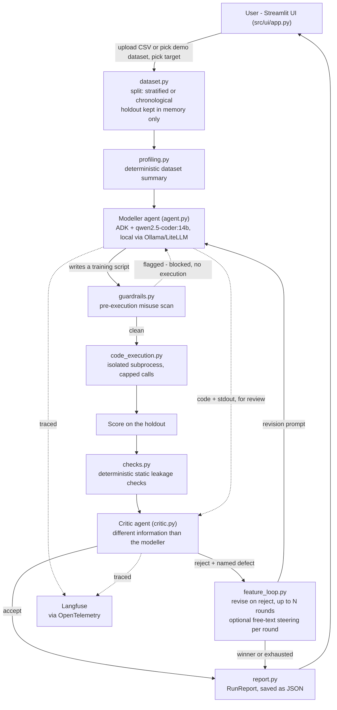

# Architecture

One diagram, medium detail. For the reasoning behind each choice, see `agent_docs/decisions.md`.

Notes:

- The critic sees the generated code, its output, and the static checks' findings, but not the modeller's own reasoning - it is deliberately kept independent, so it cannot just agree with the modeller's framing.
- The holdout is only ever touched by the scoring step, never by the modeller or the sandbox.
- The evaluation harness and red-team harness (`src/evaluation.py`, `src/red_team.py`, run via `scripts/`) reuse this same pipeline offline, against hand-written fixtures instead of live data. See `EVALUATION.md`.
