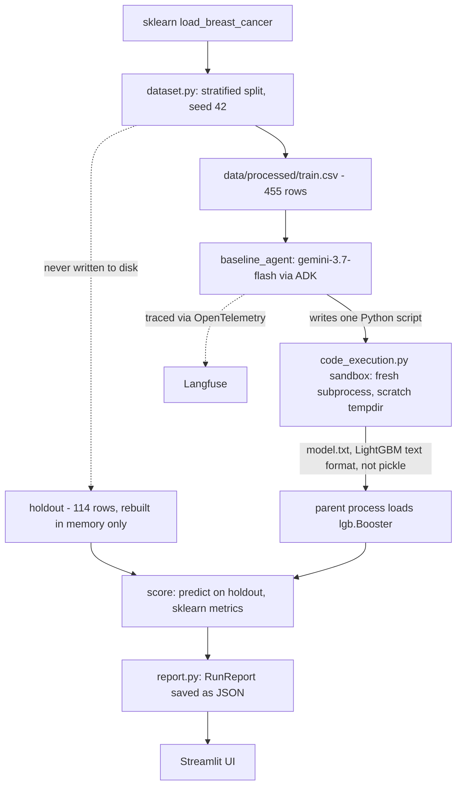
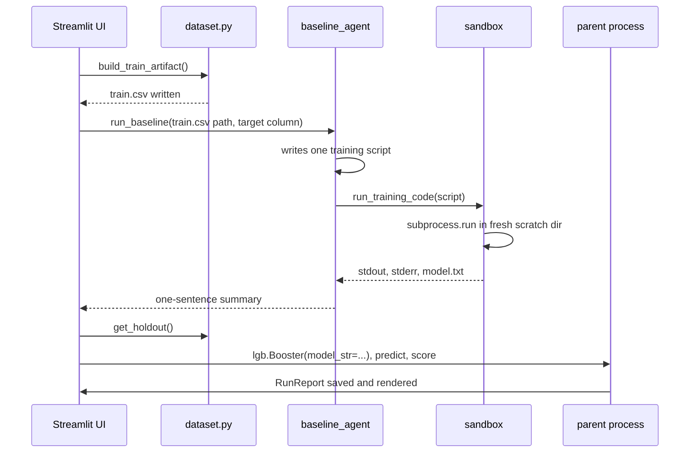
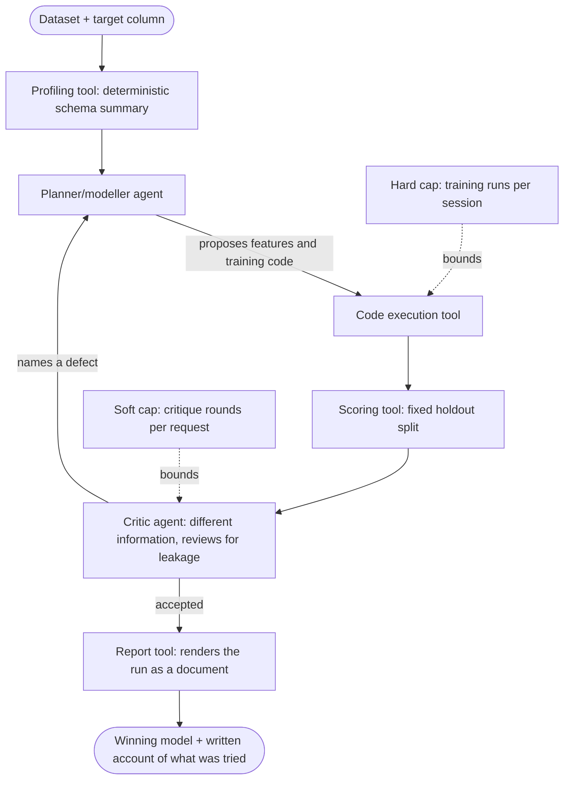

# Architecture

Two views below: what is built right now (Phase 2, one dataset, one baseline), and how the final product (proposal phases 3-6, `references/project-proposal.md`) would extend it. Diagrams first, notes are short.

## Current architecture

Notes:

- One agent, one shot. No planner/modeller split yet, no critic, no revision loop. It writes one script and stops.
- The holdout never touches disk and never enters the sandbox. The agent only ever sees `train.csv`.
- The model crosses the sandbox boundary as LightGBM's own text format, not pickle, so a malicious or buggy generated script cannot execute code in the trusted parent process by way of a poisoned pickle.
- No profiling tool. The agent is told the CSV path and target column directly, not a deterministic schema summary.
- No separate scoring tool component. Scoring is inline in `agent.py`, but it already respects the same rule a real scoring tool would: it is the only thing that ever sees the holdout.
- Run records are plain JSON files under `data/processed/runs/`, one per run, which is what the UI's run history reads.

## Final product would add

Notes:

- The one agent splits into two: a planner/modeller that proposes and builds, and a critic that reviews. They get different information on purpose, so the critic cannot just agree with the modeller's framing.
- The loop can revise: a named defect sends the modeller back to try again, not just a pass or fail.
- A profiling tool replaces telling the agent the schema directly, so the model never guesses at types, cardinality, or missingness.
- The evaluation harness plants known leaks in a clean dataset and measures the critic's detection rate against its false-alarm rate on clean runs. That is what actually tests whether the critic is doing its job.
- Two budgets, not one: a hard ceiling on training runs (already built, `code_execution.py`, 20 calls per session) and a new soft ceiling on critique rounds per request.
- Optional, later: the critic runs as its own A2A service with dataset access over MCP, rather than in-process.
