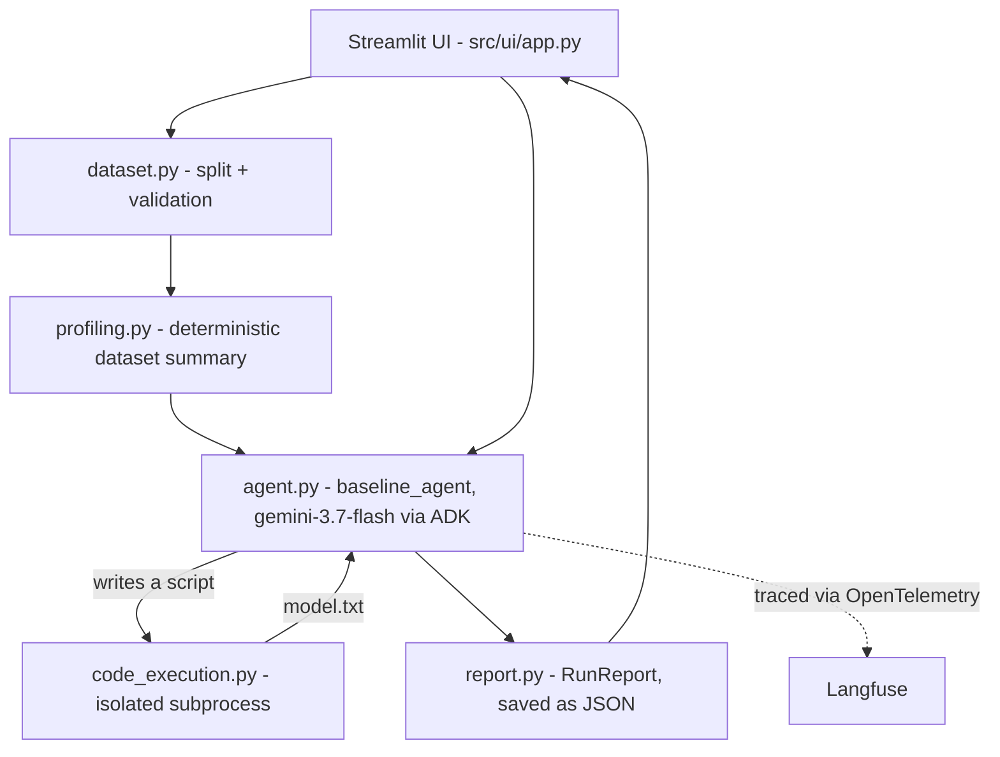
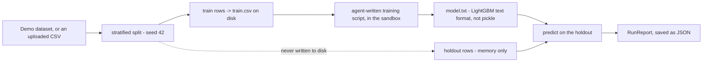
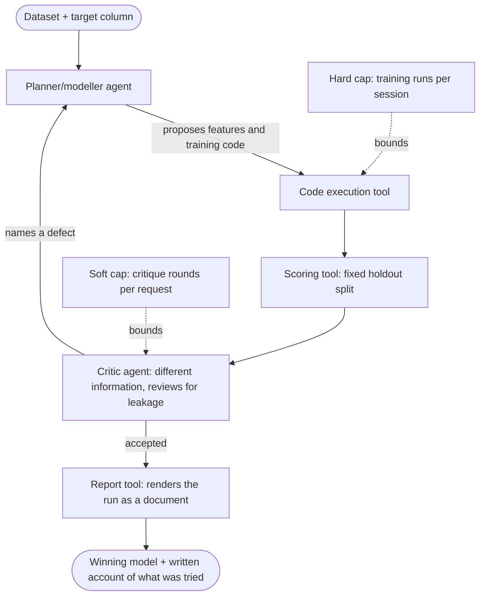

# Architecture

Two views below: what is built right now, and how the final product (proposal phases 3-6, `references/project-proposal.md`) would extend it. Diagrams first, notes are short.

## Functionalities

The six things the finished product should do, from `references/project-proposal.md`. Time risk is marked on the ones that could realistically slip past a deadline.

- Profile a dataset: a deterministic summary of types, cardinality, missingness, target balance, and obvious keys, so the model reads facts instead of guessing at schema. Done (`src/profiling.py`).
- Propose features in plain language, then implement them as code: the agent states an idea before it writes the script for it, rather than jumping straight to a training script the way today's single-shot agent does. Time risk: needs a real feature-proposal step, not just reused scaffolding.
- Train and score several baseline models under a compute budget: several attempts compared, not the one baseline built today, capped by the hard ceiling already in `code_execution.py`. Moderate time risk, mostly extends what already runs.
- Critique each accepted result for leakage and contamination, and reject with a named reason: the actual point of the project, a second agent given different information than the one that produced the result. Highest time risk of the six, since calibrating real detections against false alarms is genuinely hard, but it is the core differentiator - it should get first claim on remaining time, not be the one cut if time runs short.
- Report what was tried, what won, and what was rejected and why: a written account of the whole run. Low time risk, today's run report and UI already extend directly into this.
- Emit a runnable script or notebook that reproduces the winning result from scratch: a standalone reproducibility artefact, separate from the interactive run. Highest risk of being cut - real engineering effort for a feature the demo itself does not depend on.

## Current architecture

Notes:

- One agent, one shot. No planner/modeller split yet, no critic, no revision loop. It writes one script and stops.
- Works against the built-in Breast Cancer Wisconsin demo or any uploaded binary-classification CSV - same pipeline either way, picked in the UI.
- No separate scoring tool component. Scoring is inline in `agent.py`, but it already respects the same rule a real scoring tool would: it is the only thing that ever sees the holdout.

## Data flow

Notes:

- The holdout never touches disk and never enters the sandbox - the agent only ever sees `train.csv`. For the demo dataset it is rebuilt from the fixed seed each time it's needed; for an upload there is no source file to regenerate it from, so it is simply never written in the first place (ADR-005, ADR-007).
- The model crosses the sandbox boundary as LightGBM's own text format, not pickle, so a malicious or buggy generated script cannot execute code in the trusted parent process by way of a poisoned pickle (ADR-006).

## Final product would add

Notes:

- Profiling already exists and already feeds the single agent's prompt today - what's new here is splitting that one agent into two.
- The one agent splits into two: a planner/modeller that proposes and builds, and a critic that reviews. They get different information on purpose, so the critic cannot just agree with the modeller's framing.
- The loop can revise: a named defect sends the modeller back to try again, not just a pass or fail.
- The evaluation harness plants known leaks in a clean dataset and measures the critic's detection rate against its false-alarm rate on clean runs. That is what actually tests whether the critic is doing its job.
- Two budgets, not one: a hard ceiling on training runs (already built, `code_execution.py`, 20 calls per session) and a new soft ceiling on critique rounds per request.
- Optional, later: the critic runs as its own A2A service with dataset access over MCP, rather than in-process.
